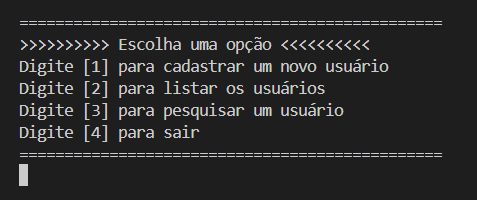
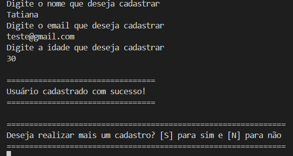
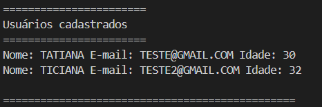
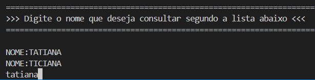
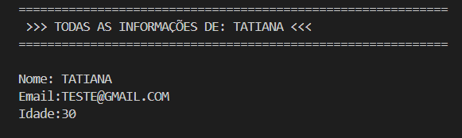

# Cadastro de Usuários

Esse projeto consiste em um programa de console simples construido em C# usando o framework .NET que permite o o cadastro, listagem de todos os usuários e busca de um usuário especifico por nome.

## Configuração Recomendada

 - *.NET - para esse projeto foi utilizada a versão 9.0. Ele é multiplataforma, faça o download [aqui](https://dotnet.microsoft.com/pt-br/download)*

 - *Ferramenta de versionamento de código - [GIT](https://git-scm.com/downloads). É necessário configurar o git uma vez instalado para sua vinculação com o Git Hub. A documentação oficial pode ser acessada por esse link >> [Documentação Git](https://git-scm.com/docs).*

 - *Conta no Git Hub para fazer o download do repositório por meio desse link >> [Repositório](https://github.com/biizerrah/Cadastro-de-Usuarios)* 

 - *IDE para rodar o projeto. Recomendo o [Visual Studio Code](https://code.visualstudio.com/download) com as extensões [.NET extension Pack](https://marketplace.visualstudio.com/items?itemName=ms-dotnettools.vscode-dotnet-pack), [C#](https://marketplace.visualstudio.com/items?itemName=ms-dotnettools.csharp) e [C# Dev Kit](https://marketplace.visualstudio.com/items?itemName=ms-dotnettools.csdevkit)*

 ## Instuções de Uso

Com as configurações necessárias e com o projeto já baixado, entre na pasta, abra o terminal da sua IDE e...

* 1 - Rode o seguinte comando para garantir que todas os arquivos estarão presentes na sua máquina para rodar o projeto.
~~~
dotnet restore
~~~

* 2 - Faça o build do projeto
~~~
dotnet build
~~~

* 3 - Rode o projeto
~~~
dotnet run
~~~

## Funcionamento do programa

**Menu Inicial**

**Cadastrar um usuário - Com os campos: nome, email e idade. Ao cadastrar o usuário atual é possivel continuar cadastrando ou não.**

**Listando os usuários cadastrados**

**Buscar um usuário por nome**

 - *Consulte a lista de nomes para saber quais usuários estão cadastrados*

 - *Após digitar o nome desejado as informações serão impressas no console*

 

